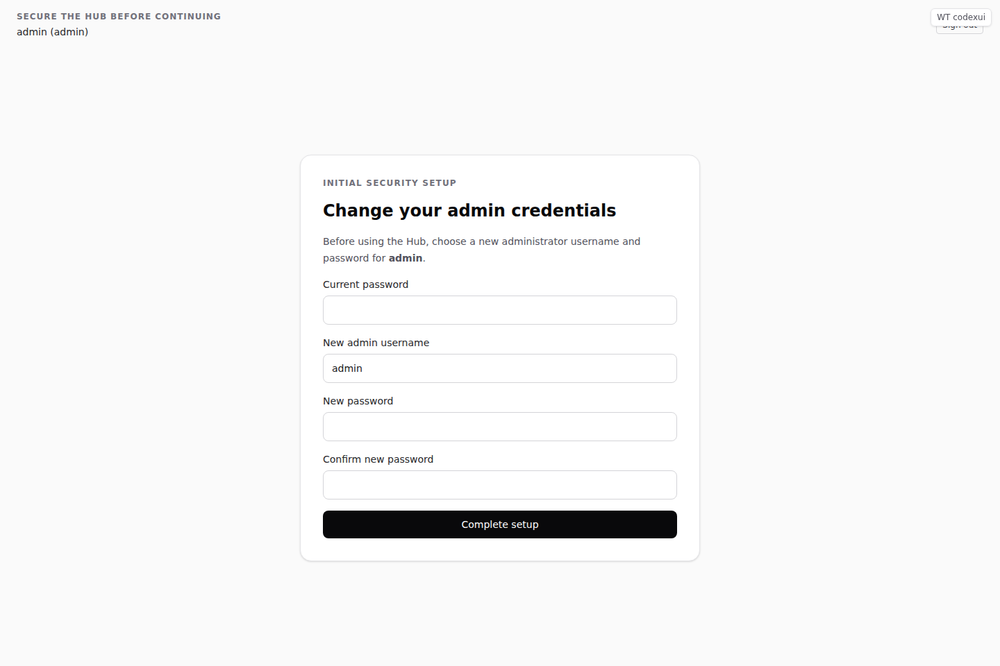
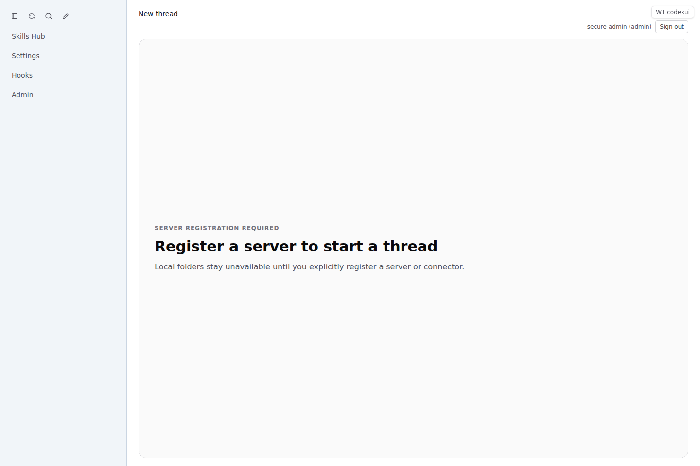

# Bootstrap Admin First-Login Setup Report

_Date: 2026-03-08_

## Scope
This rollout hardens Hub bootstrap administration so that:

- plaintext bootstrap secrets are rejected
- only precomputed password hashes can seed a bootstrap admin
- the first successful bootstrap login is forced through a one-time setup wizard
- the administrator must rotate both username and password before the rest of the app unlocks
- after setup completes, the Hub can restart from SQLite alone without recreating the bootstrap admin

## Delivered

### 1. Hash-only bootstrap credential model
- The CLI and Docker entrypoint now reject plaintext bootstrap password inputs.
- Supported bootstrap sources are limited to `CODEXUI_ADMIN_PASSWORD_HASH(_FILE)` and `--password-hash`.
- If no bootstrap hash is configured, the Hub starts normally and relies on SQLite-backed users only.

**Commits**
- `6e82cb7` — `Add bootstrap setup-required auth gate`
- `4fac3bb` — `Harden bootstrap admin authentication flow`

### 2. Backend setup gate
- `/auth/login` and `/auth/session` now expose:
  - `setupRequired`
  - `mustChangeUsername`
  - `mustChangePassword`
  - `bootstrapState`
- Added `POST /auth/bootstrap/complete`.
- Setup-required bootstrap sessions are blocked from `codex-api` routes until rotation completes.
- Browser navigation is redirected back to `/setup/bootstrap-admin` until setup finishes.
- Completed bootstrap admins are marked as consumed and are not recreated on restart.

### 3. First-login setup wizard UI
- Added a dedicated `/setup/bootstrap-admin` route.
- The app shell is replaced with a focused setup screen while `setupRequired === true`.
- The wizard forces a new admin username and password before the rest of the UI unlocks.
- Sign-out remains available from the setup screen.

**Commit**
- `4f0d19d` — `Add bootstrap admin setup wizard`

## TDD evidence

### Contract / integration
- `tests/multi-server/bootstrap-admin-first-login-gate.test.mjs`
- `tests/multi-server/bootstrap-admin-password-hash.test.mjs`
- `tests/multi-server/sqlite-persistence.test.mjs`
- `tests/multi-server/connector-scoped-fs-bridge.test.mjs`

### Playwright
- `tests/playwright/bootstrap-admin-setup.spec.ts`
- `tests/playwright/phase2-admin-ui.spec.ts`
- `tests/playwright/signup-approval.spec.ts`

## Verification

### Build
- `npm run build` ✅

### Contract / integration suite
- `npm run test:multi-server` ✅ (**44 passed**)

### Playwright
```bash
npx playwright test \
  tests/playwright/bootstrap-admin-setup.spec.ts \
  tests/playwright/phase2-admin-ui.spec.ts \
  tests/playwright/signup-approval.spec.ts \
  --reporter=line
```

Result: **4 passed** ✅

## Screenshots

### Forced first-login wizard


### App unlock after rotation


## Operational notes
- Fresh installations should set `CODEXUI_ADMIN_PASSWORD_HASH`, log in once, complete the setup wizard, and then remove the bootstrap hash from `.env`.
- Helper scripts (`docker:hub:smoke`, `docker:hub:register-local`) now expect `CODEXUI_ADMIN_LOGIN_PASSWORD` only at runtime.
- Once setup is complete, future Hub restarts do not need a bootstrap secret.
