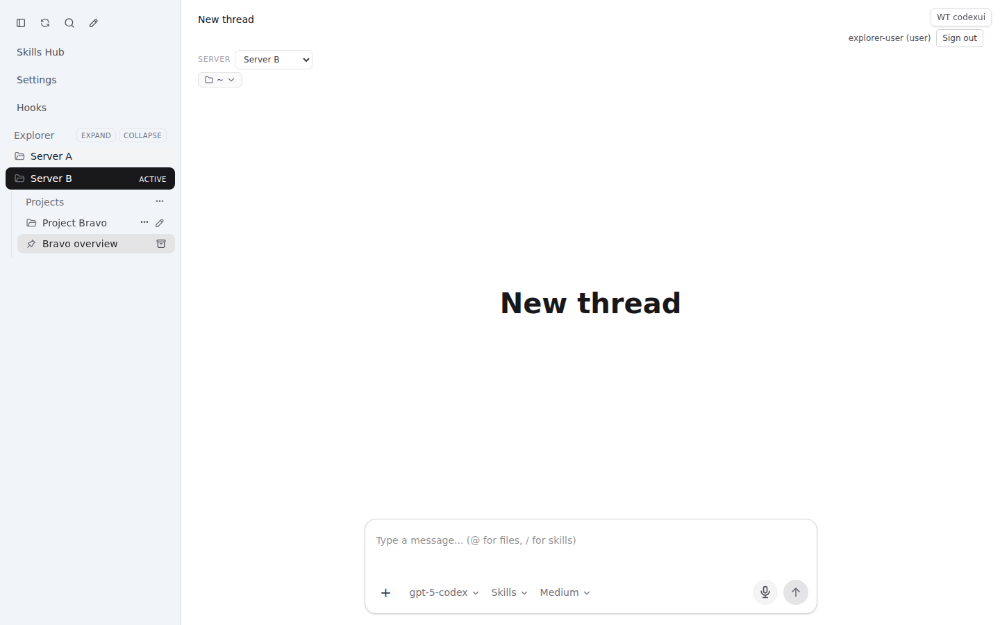
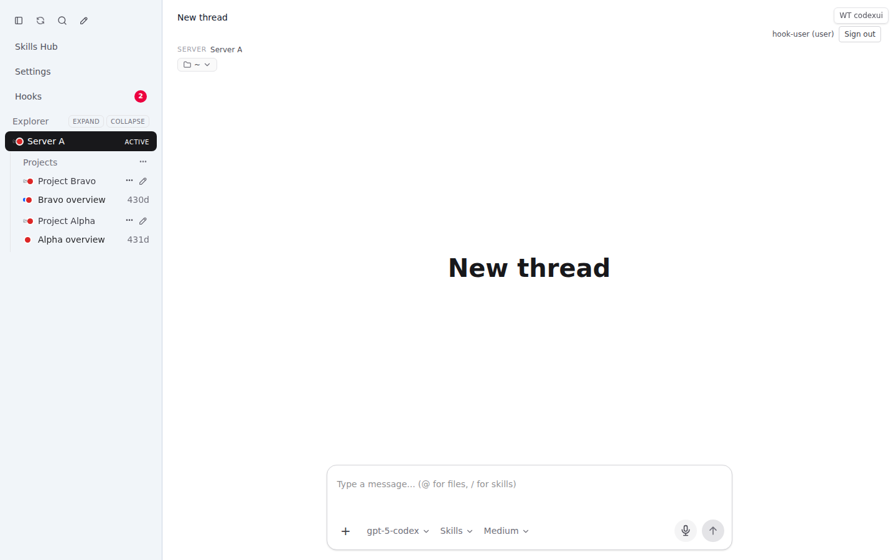
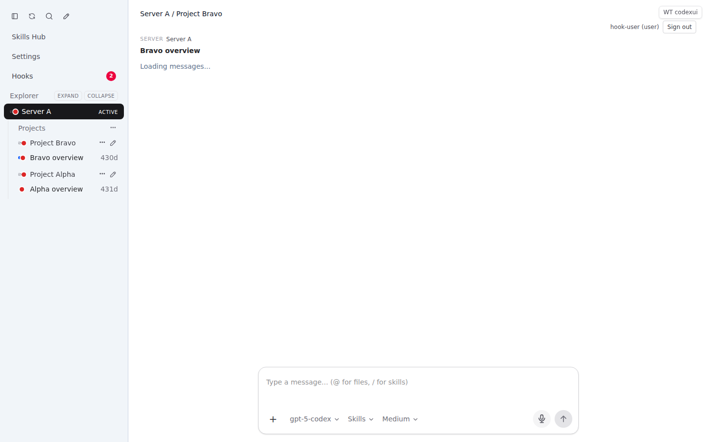
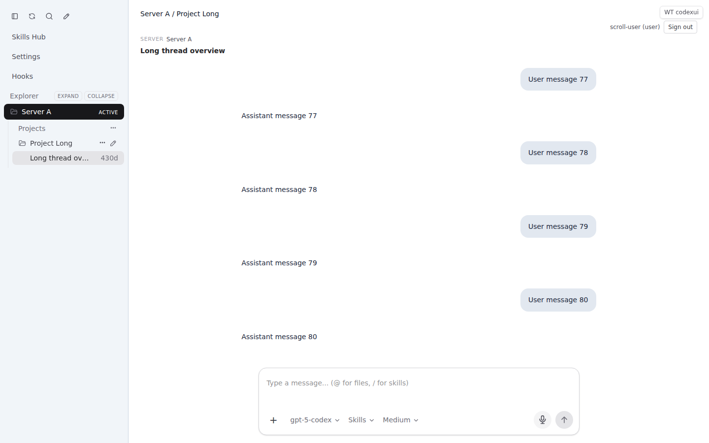
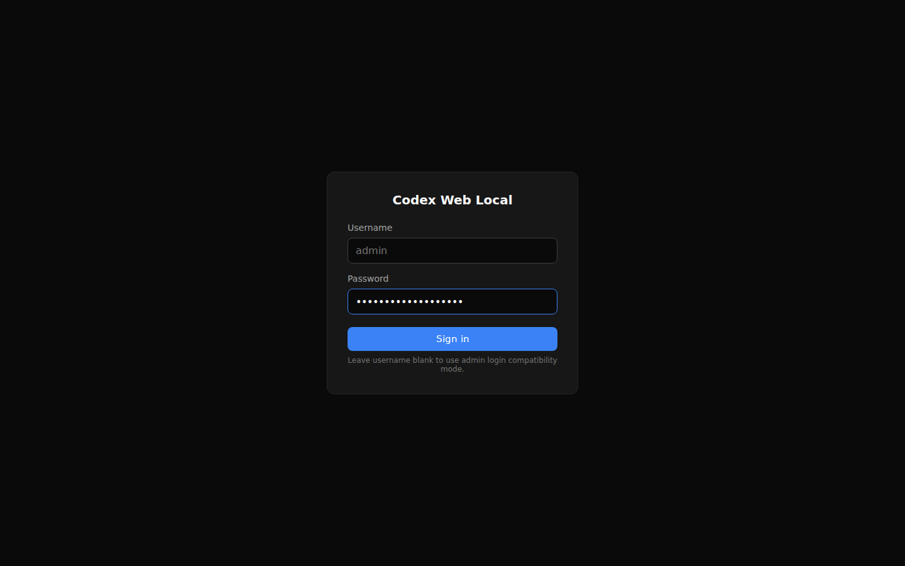
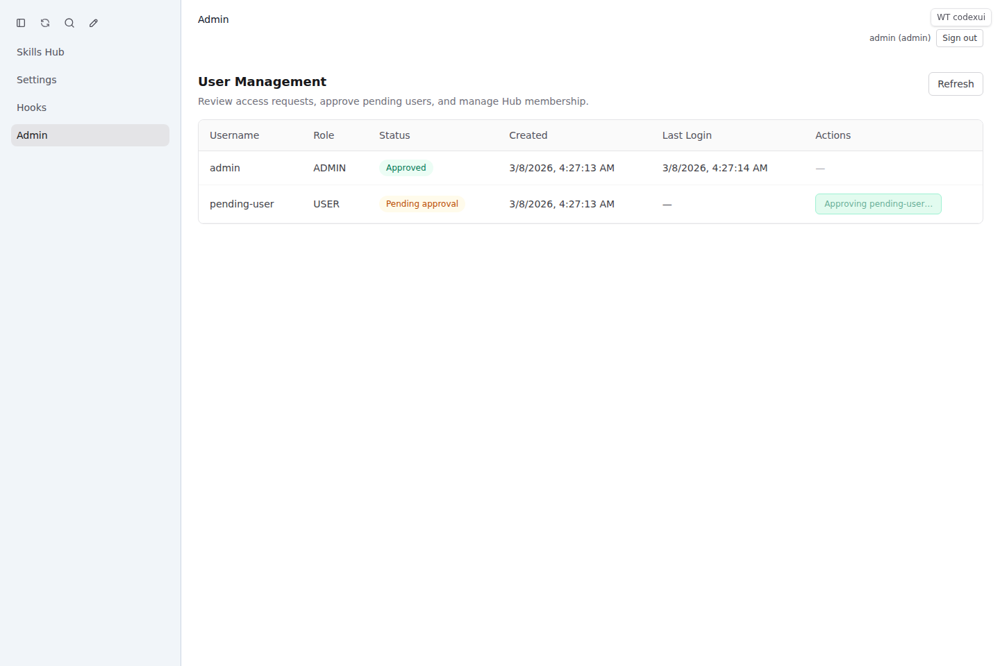
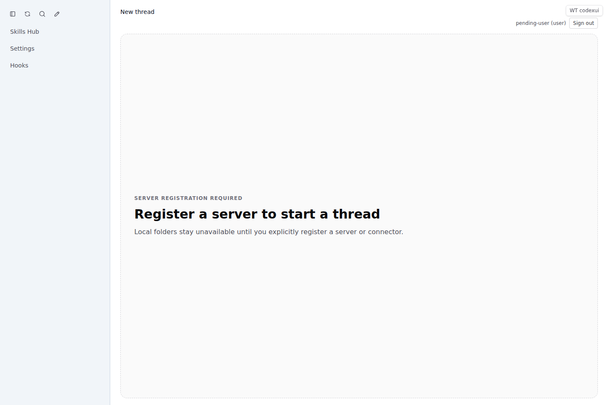
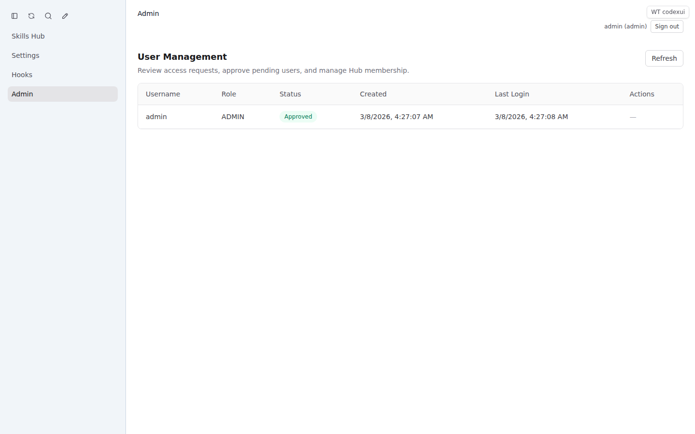
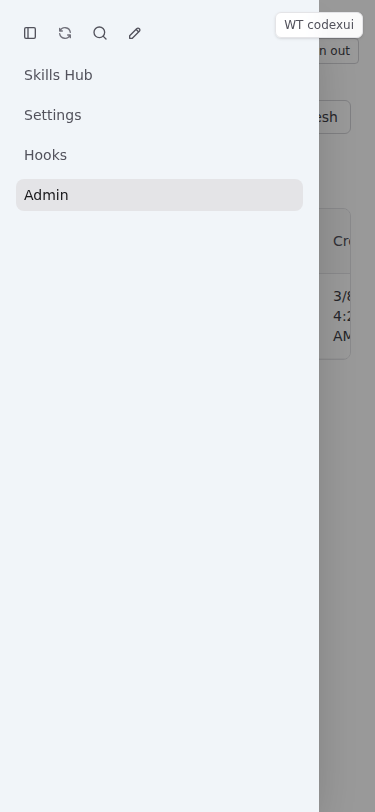

# Explorer / Hooks / SQLite Auth Rollout Report

_Date: 2026-03-08_

## Scope
This report covers the follow-up execution after the original multi-server / connector rollout:

- **Phase A** — server-scoped explorer state
- **Phase B** — hook badges + hook inbox
- **Phase C** — open-thread scroll-to-bottom behavior
- **Phase D** — SQLite-backed Hub persistence
- **Phase E** — public signup + admin approval UI flow

## Delivered

### Phase A — server-scoped explorer state
- Project labels, ordering, collapsed state, and workspace-roots state are now scoped by **server id**.
- Switching servers no longer leaks folders/projects from another server.
- Workspace-roots state is persisted per **user + server**.

**Commit**: `7fdbf26` — `Scope explorer state by server`

**Capture**



### Phase B — hook badges + hook inbox
- Added **server / project / thread** hook badges.
- Added a dedicated **Hooks** inbox route/panel.
- Hook ordering now lifts the most recently hooked project to the top.
- Clicking a hook inbox item opens the matching thread.

**Commit**: `82e6b8d` — `Add hook inbox and alert badges`

**Captures**





### Phase C — thread open scroll behavior
- Opening a thread now jumps to the **latest message** first.
- Saved scroll state continues to work for subsequent revisits.

**Commit**: `38f106c` — `Open threads at the latest message`

**Capture**



### Phase D — SQLite-backed Hub persistence
- Hub state moved to **SQLite** at `CODEX_HOME/codexui/hub.sqlite`.
- Bootstrap admin credentials, user rows, server registries, connector registries, and persisted Hub state now survive restarts via SQLite.
- Legacy `users.json` / `.codex-global-state.json` are imported on first run and then superseded by SQLite-backed storage.

**Commit**: `20b11b5` — `Migrate hub persistence to SQLite`

**Capture**



### Phase E — public signup + admin approval
- Added a public **Request access** flow on the login page.
- Newly registered users stay **pending** until approved by an admin.
- Added admin approval controls in **Admin Panel**.
- Approved users can sign in immediately after approval.
- Connector/server isolation remains user-scoped.

**Commit**: `c18fb2d` — `Add approval-driven admin UI flows`

**Captures**









## Verification

### Build
- `npm run build` ✅

### Contract / integration tests
- `npm run test:multi-server` ✅ (**37 passed**)

### Playwright validation

The final verification run used a live Vite dev server for mocked SPA scenarios and live `dist-cli` Hub instances for auth/admin approval scenarios.

Command:

```bash
npm run build
npm run test:multi-server

PLAYWRIGHT_BASE_URL=http://127.0.0.1:4310 npx playwright test \
  tests/playwright/explicit-registration-empty-state.spec.ts \
  tests/playwright/server-scoped-explorer.spec.ts \
  tests/playwright/hooks-inbox.spec.ts \
  tests/playwright/thread-open-scroll.spec.ts \
  tests/playwright/settings-connectors.spec.ts \
  tests/playwright/phase2-admin-ui.spec.ts \
  tests/playwright/signup-approval.spec.ts \
  --reporter=line
```

Result: **10 passed** ✅

## Screenshot inventory

### Core rollout
- `docs/screenshots/server-scoped-explorer-desktop.png`
- `docs/screenshots/hooks-sidebar-order-desktop.png`
- `docs/screenshots/hooks-inbox-open-thread-desktop.png`
- `docs/screenshots/thread-open-scroll-bottom-desktop.png`
- `docs/screenshots/bootstrap-admin-password-hash-login.png`
- `docs/screenshots/signup-approval-admin-desktop.png`
- `docs/screenshots/signup-approval-user-desktop.png`
- `docs/screenshots/phase2-admin-desktop.png`
- `docs/screenshots/phase2-admin-mobile.png`

### Regression captures also refreshed during final verification
- `docs/screenshots/explicit-registration-empty-state-desktop.png`
- `docs/screenshots/settings-connectors-desktop.png`
- `docs/screenshots/settings-connectors-expired-desktop.png`

## Notes
- The Hub now uses SQLite as the authoritative store for users and persisted Hub/global state.
- New non-admin users must be approved before sign-in succeeds.
- Explorer state, server registries, connector registries, and approval-driven auth flows were all revalidated in the final end-to-end run.
